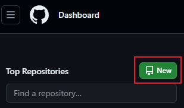
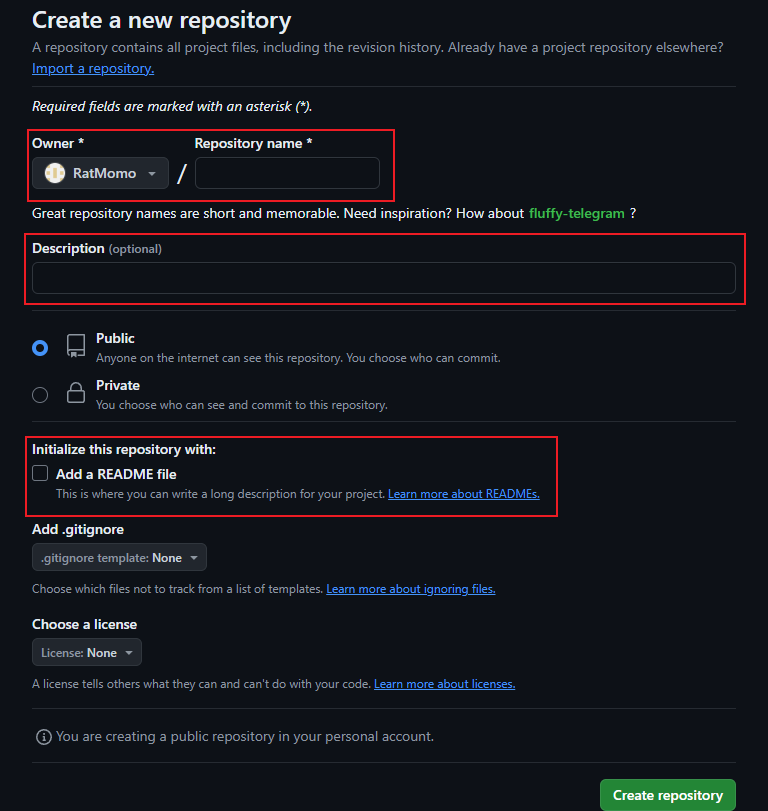
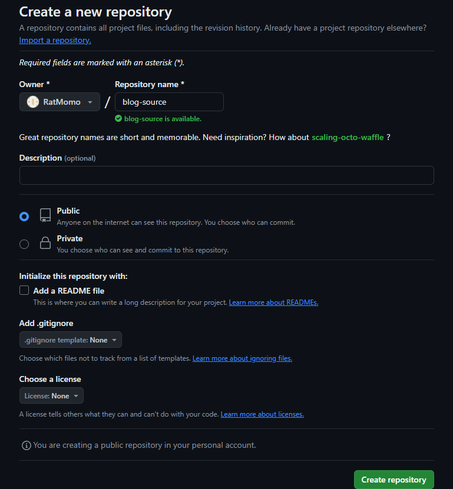
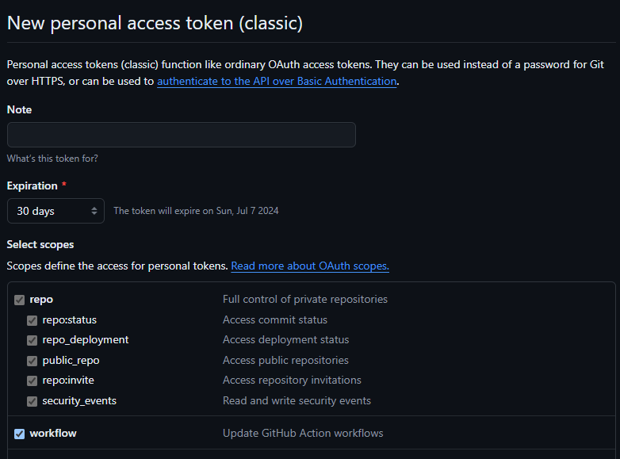
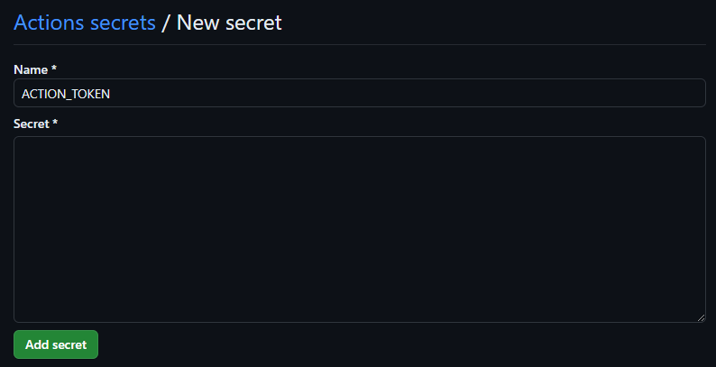

## 配置环境

- Windows PC一台且已经安装有Git
- Github账号一个

## 创建博客仓库

1. 在[github主页](https://github.com/)点击New按钮为博客创建一个仓库





1. 在**Repository name**项填写仓库名，注意必须使用`<user>.github.io`的格式，`<user>`为Github用户名。可选在**Description**填写仓库描述，注意需要勾选**Initialize this repository with a README**选项。





## 安装Hugo

1. 版本较新的Windows推荐直接使用winget的方式安装Hugo，其他操作系统的安装方法可以查阅官方文档：[Hugo官方文档](https://gohugo.io/getting-started/installing/)

```shell
winget install Hugo.Hugo.Extended
```

2. 如果使用Chocolatey命令如下：

```shell
 choco install hugo-extended 
```

3. 安装完成后查看hugo版本验证安装是否成功

```shell
hugo version 
```


## 在本地创建博客项目文件夹

1.创建一个文件夹用于存放博客项目并在终端中打开

2.使用hugo创建网站项目

```
hugo new site ratmomo-blog # 可以替换成任意你想要的名字
```

## 安装主题

1. 找到一款你喜欢的主题，可以使用[Hugo社区提供的主题](https://themes.gohugo.io/)，也可以使用你从其他地方找的心仪主题
2. 根据主题的页面或者主题提供的文档安装主题，例如本博客使用的主题[Stack](https://stack.jimmycai.com/)。鉴于我们已经使用了Git创建网站文件，我们使用`git submodule`命令将主题作为子模块使用

```
git submodule add https://github.com/CaiJimmy/hugo-theme-stack/ themes/hugo-theme-stack
```

3. 将`themes`文件夹中安装好的主题中的`exampelSite`文件夹中的配置文件`hugo.yaml`(也有可能是`hugo.toml`之类的)复制到你的项目文件夹中，再将`archetypes`中的文件复制到你的项目文件夹的`archetypes`中，根据配置文件的注释和主题的官方文档修改配置，如果使用的是我推荐的**Stack**，需要注意以下配置：

```toml
 baseurl: https://example.com  # 需要修改成你的网站<user>.github.io 
 title: Example Site # 需要修改成你想在标签页显示的名称 
 DefaultContentLanguage: en # 如果是中文博客注意修改成zh-cn，以添加i18n支持 
 hasCJKLanguage: false # 如果是DefaultContentLanguage修改成zh-cn，修改为true 
 sidebar:    
 	emoji: 🍥    
 	subtitle: Lorem ipsum dolor sit amet, consectetur adipiscing elit.    
 	avatar:        
 		enabled: true        
 		local: true        
 		src: img/avatar.png # 头像的位置在assets/img/avatar.png 
 article:    
 	math: false # 使用数学公式需要打开
```

## 创建文章

使用**Hugo**创建文章，生成的**Markdowen**文件的元数据中**image**可以指定文章封面，**draft**表示文章是否属于草稿，草稿文件不会被发布，**hidden**表示文章是否会被隐藏

```
hugo new post/test/index.md
```

1.完成后可以使用以下命令预览：

```
hugo server -D 
```

## 发布文章

直接执行`hugo`命令可以为你的博客项目在public文件夹中生成静态的html文件，发布博客实际上只需要向仓库推送public文件夹中的内容

```
hugo
cd .\public\
```

将public文件夹初始化为git仓库，并将远程仓库地址设置为Github Pages的仓库地址

```
 git init -b main  
 git remote add origin 你的远程仓库地址 
 git add . 
```

随后便可以推通过Git推送文章了

```
 git commit -m "First commit" 
 git push -u origin main`
```

## 番外篇：自定义你的站点

### 自定义网站图标

在配置文件`hugo.yaml`中可以指定网站的图标

```
params:    
	favicon: /favicon.ico # 实际上的位置是static/favicon.ico
```


将你的ico图标文件放置在你的项目文件夹中的static文件夹并命名为favicon即可

### 修改你的主题

这里以为stack主题的article页面添加网易云音乐的外链为例：在`themes\hugo-theme-stack\layouts\partials\article\components`文件夹中新建一个文件`music.html`写入网易云音乐的外链模板

```toml
<!-- .Params.musicid可以获取Markdown文件元数据中的musicid这个属性，这样我们便可以在markdown中指定我们要插入文章的音乐 --> 
<iframe frameborder="no" border="0" marginwidth="0" marginheight="0" width=100% height=86    		src="//music.163.com/outchain/player?type=2&id={{ .Params.musicid }}&auto=0&height=66">  
</iframe>
```


我希望网易云音乐的外链在页面中位于文章中的标题之下，文章内容之上，所以需要编辑content.html的内容

```toml
<section class="article-content">
	<!-- Refer to https://discourse.gohugo.io/t/responsive-tables-in-markdown/10639/5 -->    
	{{ $wrappedTable := printf "<div class=\"table-wrapper\">${1}</div>" }}    
	<!-- 下面三行是增加的内容 -->    
	{{ if .Params.musicid }}    
	{{ partial "article/components/music" . }}    
	{{ end }}    
	{{ .Content | replaceRE "(<table>(?:.|\n)+?</table>)" $wrappedTable | safeHTML }} 
</section> 
```


打开项目目录下的`archetypes`中的`default.md`文件，在元数据中添加一行`musicid`属性

```
 musicid: 
```

这样就完成了主题的修改，不过由于我们安装主题使用的是`Git submodule`的方法，因此本地的修改实际上不能在Github Pages产生效果，我们需要一些额外的工作。首先打开你安装的主题的Github仓库并fork


修改我们`submodule`的远程仓库地址，打开项目目录下的`.gitmodules`，将`submodule`的url修改成远程仓库的地址，随后执行命令更新远程仓库地址

```
git submodule sync
```


随后将我们的修改推送到远程仓库即可

## 番外篇：使用GitHub Action自动发布博客

创建一个新的仓库，用于存放整个项目，作为博客源仓库




使用`git remote set-url`命令更改远程仓库地址

`git remote -v git remote set-url origin git@github.com:ratmomo/blog-source.git git remote -v ` 


在本地仓库中创建文件`.github\workflows\gh-pages.yml`

```yaml
name: GitHub Pages 

on:  
	push:    
		branches:      
			- main  # Set a branch to deploy  
		pull_request: 
		
jobs:  
	deploy:    
		runs-on: ubuntu-22.04    
		concurrency:      
			group: ${{ github.workflow }}-${{ github.ref }}    
		steps:      
			- uses: actions/checkout@v4        
			with:          
				submodules: true  # Fetch Hugo themes (true OR recursive)          
				fetch-depth: 0    # Fetch all history for .GitInfo and .Lastmod       
			- name: Setup Hugo        
			uses: peaceiris/actions-hugo@v3        
			with:          
				hugo-version: '0.127.0' # 注意修改成你的hugo版本，以防兼容性错误          
				extended: true # 是否启用hugo extended       
			
			- name: Build        
			run: hugo --minify        
			working-directory: ./ratmomo-blog # 注意修改成你使用hugo创建的项目名称       
			
			- name: Deploy        
			uses: peaceiris/actions-gh-pages@v3        
			if: github.ref == 'refs/heads/main'        
			with:          
				PERSONAL_TOKEN: ${{ secrets.ACTION_TOKEN }}          
				PUBLISH_DIR: ./ratmomo-blog/public # 注意修改成你使用hugo创建的项目名称
				EXTERNAL_REPOSITORY: ratmomo/ratmomo.github.io # 你的Github Pages远程仓库名          
				#PUBLISH_BRANCH: master 如果不想推送到gh-pages分支，可以添加这一行
```


在[Github Profile](https://github.com/settings/profile)页面下**Developer setting - Personal access tokens**中创建一个tokens，注意勾选**repo**和**workflow**权限





在博客源仓库的**Settings-Secrets and variables-Actions-Repository secrets**中添加一个**ACTION_TOKEN**内容为刚刚创建的tokens




接下来直接push本地的修改到远程博客源仓库，Github Action会为我们完成生成静态页面和推送到GitHub Pages仓库的任务

如果之前配置的推送目标时gh-pages分支，注意将GitHub Pages仓库的**Sittings - Pages - Build and deployment - Branch**修改为gh-pages

## 参考

> [Hugo Documentation | Hugo](https://gohugo.io/documentation/)
>
> [Site-wide settings | Stack](https://stack.jimmycai.com/config/site)
>
> [如何用 GitHub Pages + Hugo 搭建个人博客 · 小绵尾巴](https://cuttontail.blog/blog/create-a-wesite-using-github-pages-and-hugo/#8-本地调试和预览)
>
> [Hugo 博客引入 Giscus 评论系统 -](https://www.lixueduan.com/posts/blog/02-add-giscus-comment/#5-配置到博客)
>
> [Hugo + GitHub Action，搭建你的博客自动发布系统 · Pseudoyu](https://www.pseudoyu.com/zh/2022/05/29/deploy_your_blog_using_hugo_and_github_action/)