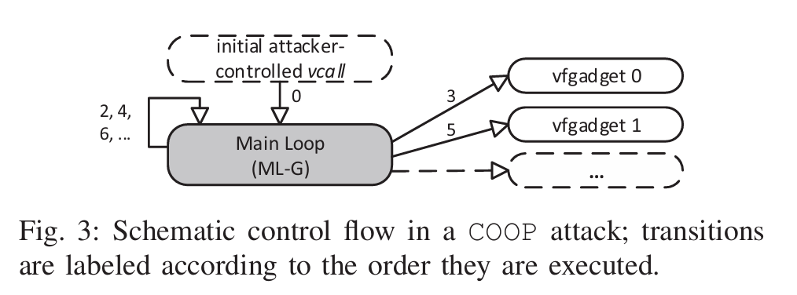
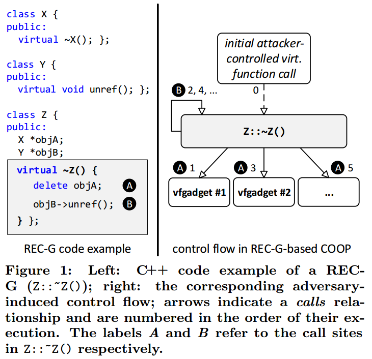
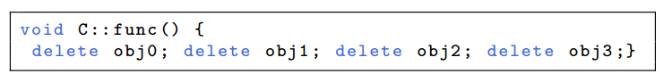

# It's a TRaP: Table Randomization and Protection against Function-Reuse Attacks阅读笔记

**报告目录**

- **要解决什么问题**
- **相关背景知识**
- **该领域研究现状**
- **本论文实现目标**
- **论文核心思想**
- **论文主要贡献**
- **本文具体工作内容分析**
- **论文中的攻击模型和假设**
- **实验结果评价**
- **结论**

## 要解决什么问题

现有的解决方案关注于返回导向编程技术的攻击，对于像return-into-libc的重用整个函数的攻击很少关注。counterfeit object-oriented programming(COOP) attack表明通过重用动态绑定函数可以绕过现有的防御方案。本文的目的是提高和简化COOP攻击的同时设计防御重用动态绑定函数攻击的方法。

## 相关背景知识

1. **动态绑定函数**

   每一个具有虚函数的类都叫做多态类，这个虚函数或者是从基类继承来的，或者是自己增加的。C++ 编译器必须为每一个多态类至少创建一个虚函数表（vtable），其本质是一个函数指针数组，其中存放着这个类**所有的虚函数的地址**及该类的类型信息，其中也包括那些**继承但未改写（Override）的虚函数**。

   **动态绑定**是指：我们使用基类的引用或指针去调用虚函数，将会发生动态绑定即如果基类指针或引用指向的对象是基类对象，则调用基类的该函数，如果基类的指针或引用指向的是派生类对象则调用的是派生类中的该函数。

2. **动态链接**

   程序运行时，将库文件动态加载到内存中，并将其与可执行文件进行链接。动态库（如 `.dll`、`.so` 文件）独立于程序文件存在，多个程序可以共享相同的动态库。

   - 程序加载

   当用户启动一个程序时，操作系统的加载器（Loader）负责将程序的代码段和数据段加载到内存。

   加载器同时会识别程序依赖的动态库，并将其加载到内存中。

   - 符号解析

   在动态链接过程中，动态链接器（Dynamic Linker）负责将程序中对外部函数或变量的引用解析到动态库中对应的实际地址。动态链接器通过符号表（Symbol Table）和重定位表（Relocation Table）完成符号绑定和地址重定向。

   - 延迟绑定（Lazy Binding）

   为了提升程序启动速度，动态链接器可以采用延迟绑定机制，在程序运行到需要使用动态库的函数或变量时，才完成实际的地址解析。延迟绑定减少了启动时的开销，但可能导致首次调用某些函数时有额外的延迟。

3. **COOP(counterfeit object-oriented programming)**

   

   上图为COOP攻击中的程序流体现。在获取内存布局和控制流劫持方面，与传统的代码重用基本一致，COOP可以通过缓冲区溢出或Use-after-free漏洞，劫持一个虚函数调用，将程序流引导到一个被称为*Main Loop Gadget（ML-G）*的代码片段入口。攻击中所利用到的gadget均为程序中存在的虚函数(*vfgadget*)，为此，攻击者需要将ML-G中的调用对象替换为自己修改后的伪对象（Counterfeit Object），于是便能通过这些伪对象去调用到攻击者想要调用的虚函数。攻击流程可以分为以下三部分：
   （1） 注入伪对象，利用ML-G搭建好虚函数的调用顺序。
   （2） 利用虚函数进行恶意行为的计算以及恶意的写行为。
   （3） 最终调用系统敏感的API，实现恶意行为。

## 该领域研究现状

## 本论文实现目标

填充现存代码随机化方法在防御函数重用攻击的空白

## **论文核心思想**

1. 在保留程序语义的同时排列包含代码指针的表；
2. 在这些表中插入陷阱以减轻探测攻击
3. 转换表，使用`execute-only`页权限来防止内存泄露。

## **论文主要贡献**

1. 防御函数重用攻击

   提出了Readactor++，这是针对函数重用攻击（如counterfeit object-oriented programming(COOP)和return-into-libc (RILC)，现有的代码随机化技术无法减轻这些攻击）的第一个概率性防御方法，同时在设计防御系统时，假设对手可以任意读取和写入内存。

2. 新技术

   引入编译时间和加载时间转换协同工作，转换和随机化虚拟函数表和动态链接表

3. 真实情况下广泛的评估

   提供了完整的Readactor++模型，展示了详细的评估结果，在现有基准上提高1.1%的开销，还可以扩展到流行的浏览器。

## **本文具体工作内容分析**

1. ### Extending COOP

   - **Recurisive COOP**

     

     使用递归模拟*ML-G*，我们将遵循此模式的虚拟函数称为 ***REC-G***（递归 vfgadget）。REC-G 的工作原理如图 1 中的 C++ 代码：Z::~Z() 是一个典型的（虚拟）析构函数。它删除对象 objA 并删除对 objB 的引用，在对象 objA 和 objB 上调用虚拟函数。因此，如果在对手控制的伪造对象上调用 Z::~Z()，对手可以有效控制指针 *objA 和 *objB，并可以使这些指针指向注入的伪造对象。图 1 的右侧描述了基于 REC-G 的 COOP 攻击中攻击者诱导的控制流：实际的 vfgadget 通过 A 调用，而 B 用于递归分支到 REC-G（此处为 Z::~Z()）。

     任何编译器生成的 Z::~Z() 的 x86-64 汇编实现都不太可能触及参数寄存器，因此，对于 REC-G Z::~Z()，攻击者可以自由使用这些寄存器将参数从一个 vfgadget 传递到另一个 vfgadget（均通过调用站点 A 调用）。

     我们强调，不仅是析构函数，任何遵循 Z::~Z() 模式并在（至少）两个不同且受攻击者控制的对象指针上连续调用虚函数的虚函数都可以用作 REC-G。

   - **Unrolled COOP**

     

     假设一个虚拟函数不仅具有两次连续的虚拟函数调用（如 REC-G），而且具有多次连续的虚拟函数调用，那么也可以发起不依赖于循环或递归的简单展开 COOP 攻击，将启用展开 COOP 的虚拟函数称为 *UNR-G*。

     尽管较长的UNR-G在较大的C++应用程序中并不少见，但更短的UNR-G已经足够破坏系统，经第七节证明执行3个vfgadget足以执行任意代码。

2. ### Readactor++

   目标：证明概率防御可以阻止函数重用攻击。当与内存泄漏弹性代码随机化相结合时，可以防御所有已知的代码重用攻击。

   

## **论文中的攻击模型和假设**

### **攻击模型**

- **对手能力**
  - 系统配置：攻击者知道所应用的防御措施，并可以访问目标应用程序的源代码和非随机二进制文件。 
  - 漏洞：目标应用程序存在内存损坏漏洞，攻击者可以利用该漏洞读取和写入任意内存地址。 
  -  脚本环境：攻击者可以利用脚本环境来处理内存泄露，调整攻击负载，然后发起代码重用攻击。
- **防御需求**
  - 可写/可执行内存：目标系统确保内存可以写入或执行，但不能同时为可写或可执行。这可以防止攻击者注入新代码或修改现有的可执行代码。 
  - 只执行内存：我们在以前的强制执行Execute-only Page系统上构建，这些系统强制执行只执行内存页面，即 CPU 可以获取指令，但正常的读取或写入访问会触发访问冲突。
  - JIT 保护：我们假设已采取缓解措施，以防止代码注入 JIT 代码缓存并防止重用 JIT 编译的代码。
  - 暴力破解缓解：要求受保护的软件在遇到终止执行的陷阱后不会自动重启。在浏览器环境中，这可以通过向用户显示警告消息并关闭违规进程来实现。

## **实验结果评价**

## **结论**
