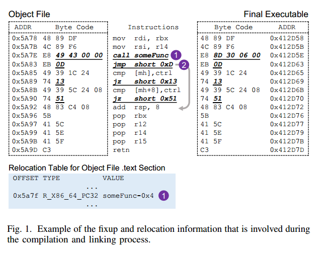
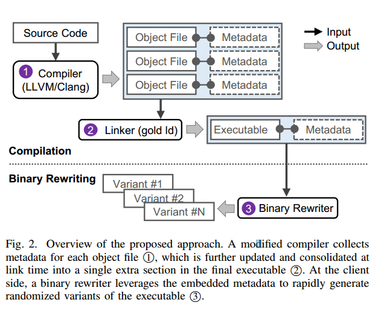
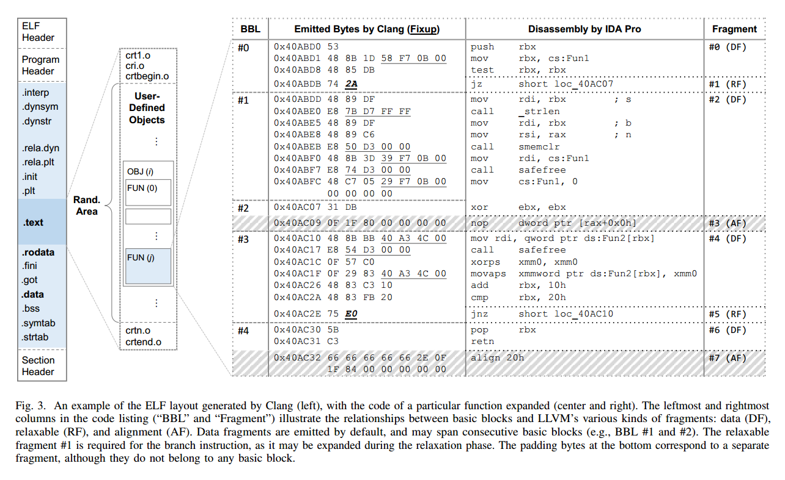
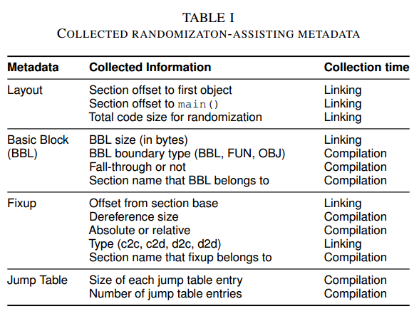
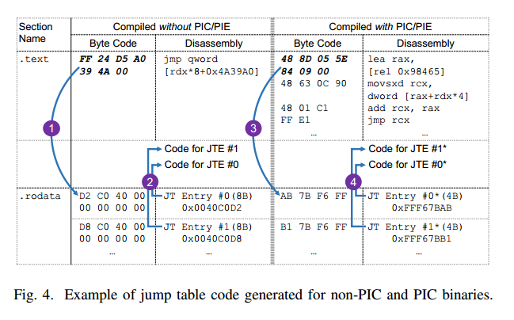
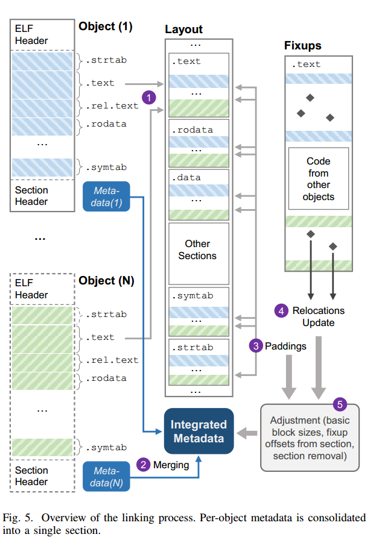
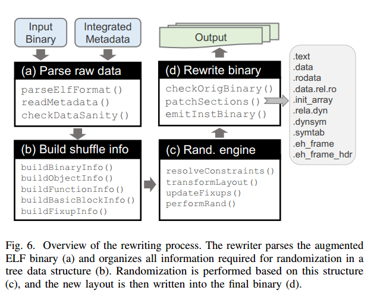
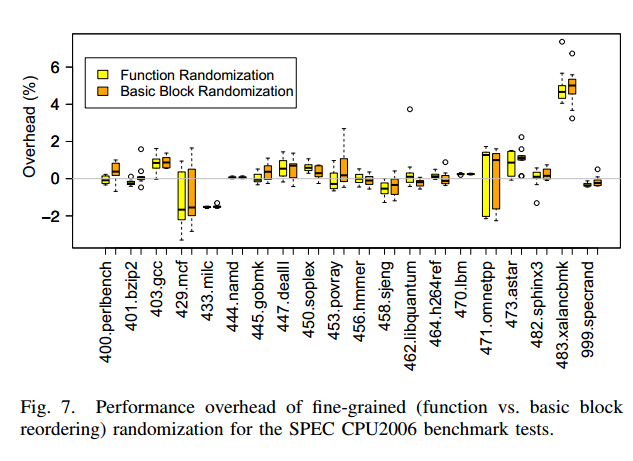
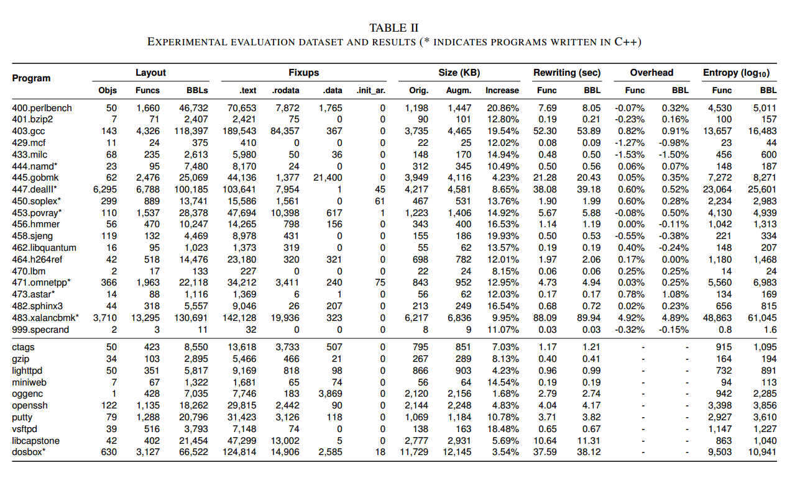

**报告目录**

- **要解决什么问题**
- **相关背景知识**
- **该领域研究现状**
- **本论文实现目标**
- **论文核心思想**
- **论文主要贡献**
- **本文具体工作内容分析**
- **工作实现**
- **论文中的攻击模型和假设**
- **实验结果评价**
- **讨论**
- **结论**

## **要解决什么问题**

现在的代码随机化防御缺乏不破坏现有软件分发规范的透明且先进的部署模式， 程序变体与错误报告、白名单、补丁和其他依赖于代码统一性的操作之间存在固有的不兼容性。在这项工作中，我们提出了编译器辅助代码随机化（CCR），这是一种混合方法，依靠编译器与改写器的合作，在终端用户系统上实现快速、稳健的细粒度代码随机化，同时保持与现有软件发布模式的兼容性。

## **相关背景知识**

**修复和重定位**

当执行代码随机化时，具有寄存器或立即操作数的机器指令在移动到新的（随机）位置后不需要任何修改。 相反，如果操作数包含如果一个指令的新位置（相对或绝对）指向一个存储器位置，那么它必须根据指令的新位置、目标的新位置或两者来调整。

对于LLVM，每当一个值还不具体时（例如，存储器位置或外部符号），其由占位符值表示，并且发出相应的修复。每个修复包含关于当相关信息在*relaxation*阶段，汇编程序根据其修复修改占位符值，因为它们变得已知。一旦松弛完成，任何未解决的修复都将成为重定位，存储在最终的目标文件中。

Note："relaxation phase"（松弛阶段）是指在编译过程中的一个特定步骤，它发生在汇编器将汇编语言代码转换为机器代码时。这个阶段的主要目的是处理那些在汇编时尚未完全确定的指令，特别是那些涉及跳转和分支指令，它们的具体地址或大小可能依赖于最终的内存布局。

目标文件中的重定位称为***link-time relocations***，即在汇编过程之后仍未解决的修复（由链接器处理）。同样，可执行文件中的重定位（或动态共享对象）作为***load-time relocations***,即链接后未解决的重定位（将由动态链接器/加载器处理）。在这个图1的示例中，最终的可执行文件不包含任何load-time relocations，因为重定位1是在链接期间解决的（0x 4349->0x 6308d）。总之，load-time relocations是link-time relocations的子集，链接时重定位是所有修复的子集。不幸的是，即使链接器完全保留了链接时重定位，它们也不足以执行细粒度代码随机化。例如，修复2较早由汇编器解决，但对于基本块重新排序是必不可少的，因为如果目标基本块从JMP指令本身向前移动超过127个字节或向后移动超过126个字节，则相应的单字节JMP指令可能必须被四字节JMP指令替换。显然，全面的修正是细粒度代码重排的关键信息。

## **该领域研究现状**

尽管进行了数十年的研究，只有地址空间布局随机化（ASLR）（以及最近 OpenBSD 中的链接时粗粒度代码排列）得到了广泛应用。更全面的技术，如细粒度代码随机化，大多还停留在学术研究阶段，主要原因有两个：i) 缺乏不破坏现有软件分发规范的透明且先进的部署模式；ii) 与成熟的软件构建、回归测试、调试、崩溃报告、诊断和安全监控工作流程和机制不兼容。

现有的代码多样化方法绝大多数依赖于代码重编译、静态二进制重写或动态二进制工具来生成随机变体。这些方法种类繁多，但在适用性、准确性和性能方面都存在权衡问题。然而，从部署的角度来看，上述所有方法都有相同的主要缺点：i) 多样化的任务在用户终端，需要大量的计算资源和专业知识；ii) 多样化的二进制文件与补丁、崩溃报告、白名单和其他依赖于软件统一性的机制不兼容。

另一种方法是让软件供应商通过向终端用户提供预先随机化的可执行文件来完成多样化过程。但产生的问题是，增加了供应商为每个用户生成一个新变体的计算成本（数量级）较高外，软件镜像、内容交付网络和其他涉及软件交付的缓存机制可使得随机化变得无效。

混合方法被认为是一种具有潜在吸引力的解决方案，本文是第一个尝试通过设计、实施和评估端到端代码转换工具链来对这一概念进行实际可行性研究的文章。之前的工作已经提出了基于自随机化二进制文件的负载时间多样化方案。这些用辅助转换的元数据来增强二进制文件方法的主要缺点是：i) 所执行的随机化粒度有限，仅限于整个函数的重新排序；ii) 缺乏向后兼容性和灵活性，而独立的重写器组件可以根据每个特定系统的特点进行选择性加固和微调。

## **本论文实现目标**

为了将编译器级代码随机化技术和二进制级代码随机化技术的优势结合起来，在这项工作中提出了编译器辅助代码随机化（compiler-assisted code randomization ，CCR），这是一种混合方法，涉及终端用户和软件供应商的合作，以实现代码随机化的实用和透明部署。

## **论文核心思想**

在供应商方面，“主二进制文件”（意在通过现有分发渠道发布）的编译过程被扩展，收集和嵌入最终可执行文件中用于协助转换的元数据信息。

在客户端，重写器组件处理被扩充的二进制文件，并利用嵌入的元数据快速生成加固变体，而无需执行任何代码反汇编或其他复杂的二进制分析。

## **论文主要贡献**

- 提出了编译器辅助代码随机化（CCR），这是一种实用的通用代码转换方法，它依赖于编译器与改写器之间的合作，能够在终端用户系统上实现快速、稳健的二进制可执行文件多样化。
- 确定了一套可嵌入可执行文件的最小元数据，以促进在基本代码块级别实现快速的细粒度代码随机化，并与依赖于引用原始代码的现有机制保持兼容。
- 通过扩展 LLVM/Clang 编译器和 GNU gold 链接器生成增强二进制文件，并开发二进制重写器利用嵌入的元数据生成加固变体，设计并实现了 CCR 的开源原型。原型支持现有功能，包括（但不限于）位置独立代码、共享对象、异常处理、内联汇编、延迟绑定、链接时间优化，甚至控制流完整性。
- 对原型进行了实验性评估，证明了它的实用性，因为平均而言，它只会使文件大小适度增加 11.46%，运行时开销仅为 0.28%，几乎可以忽略不计。

## **本文具体工作内容分析**

实用性：从部署的角度来看，一个实用的代码多样化方案不应该破坏现有的功能和软件分发模型。

兼容性：代码随机化是一种高度破坏性的操作，即使对于复杂的程序和代码结构也应该安全地适用。

绝大多数软件都以编译后的二进制文件的形式分发，在安装时，分布式软件通常经历一些后处理和定制。在这种模式下，代码随机化可以适当地作为安装期间的附加后处理任务。 随机化可以在加载时发生，但为了避免由于代码随机化所需的较长重写时间而引起的大量用户感知延迟，更可行的方法是保留一个预随机化的变体（例如，操作系统服务可以在后台生成它们），然后加载器可以立即使用。

嵌入式元数据主要有两个作用。首先，它可以安全地随机化复杂的软件，而无需依赖不精确的方法和不完整的符号或调试信息。其次，它构成了在需要时逆转任何应用代码转换的基础，以保持与依赖于引用最初发布的原始代码的现有机制的兼容性。

图 2 展示了整体方法。

编译过程基本保持不变，只是在编译每个对象文件和链接生成最终主要可执行文件时增加了元数据收集和处理步骤。然后，可执行文件就可以通过现有的分发渠道和机制提供给用户和终端，而无需进行任何更改。在每个端点的安装过程中，二进制重写器会利用嵌入的元数据生成随机化版本的可执行文件。

**编译器级的元数据**

1) **布局信息**： 首先，确定可转换区域的范围，如图 3 左侧所示。

   该区域以 .text 部分第一个对象的偏移量为起点，包含所有可以洗牌的用户定义对象。修改LLVM，在每个编译好的对象文件中添加一个名为 .rand 的新部分，这样链接器就能知道哪些对象内嵌了元数据。加载程序时，会有一系列启动例程协助引导操作，如设置环境变量和进入第一个用户定义函数（如 main()），对于这些自动插入的对象未进行转换。

2. **基本块信息**： 收集到的元数据主要与对象、功能、基本区块（BBL）和修复程序的大小和位置以及它们之间的关系有关。

   LLVM 后端将机器指令转换为相应的目标特定二进制代码，通过EmitInstruction() 例程，创建一个新的代码块，称为片段。汇编器（MCAssembler）以目标特定的方式汇编这些片段。之后在内部为每条指令标注相应的父基本模块和函数。收集过程一直持续到指令松弛完成，以捕获将写入最终二进制文件的发射字节。不过，作为最终元数据的一部分，这些标签并不重要，可以丢弃。如表 I 所示，只保留每个基本代码块的下边界信息，它可以是一个对象的结束 (OBJ)、一个函数的结束 (FUN) 或下一个基本代码块的开始 (BBL)。

   图 3 的例子中，我们可以识别出三种类型的数据片段、松弛片段和对齐片段。松弛片段只针对分支指令且只有一个单独指令所产生；对齐片对对应于填充比特；剩余指令作为数据段进行发布。另一个考虑是*fall-through*基本块，以条件分支结束的基本模块会根据条件的评估结果，隐含地跳转到它的后继模块，必须对这类跳过的基本模块进行标记，以便在重新排序时对其进行适当处理。

3. **修复信息**：评估修复信息和生成重定位条目是布局最终确定过程中最后一个处理阶段的一部分，也就是发射实际代码字节之前。

   如表 I 所示，我们将除了`.text`节的其余节定义为数据，并将其分为四类：代码到代码（c2c）、代码到数据（c2d）、数据到代码（d2c）和数据到数据（d2d）。

4. **跳转表信息**：对于非 PIC/PIE（位置无关代码/可执行文件）二进制文件，编译器会生成跳转表项，使用其绝对地址。在 PIC 可执行文件中，跳转表项与相对偏移量相对应，与可执行文件的加载地址无关。

   为了适当地修补此类跳转表结构（编译器不会为其提供额外信息），我们必须保留的唯一额外信息就是跳转表中的条目数和每个条目的大小。如表 I 所示，这些信息将与其他修补元数据一起保存，因为跳转表项中的相对偏移量在随机化后应根据相应目标的新位置进行更新。

   
   
   **Link-time Metadata 合并**
   
   
   
   1. 首先每个对象各个部分会根据命名规则合并为一个部分
   2. 每个对象的元数据也会被提取合并为一个部分
   3. 链接器会在同一个节中引入填充字节，每个对象文件末尾的基本块大小根据填充大小调整
   4. 布局最终确定，符号得到解决，链接器就会更新汇编器记录的重定位
   5. 更新二进制级别的元数据
   
   需要考虑的一个问题时对象文件可能包含多个节，链接器观察到冗余部分时（同一命名空间具有相同的识别器），它会不确定地保留其中一部分，而丢弃其余部分。这一重复数据删除过程会导致作为元数据保存的布局和修正信息出现差异。在编译过程中，我们会为基本区块和修复区段保留名称信息，重复数据删除完成后，有关基本区块和修复的任何剩余区段名称信息都会被丢弃，从而进一步减少最终元数据的大小。

**代码随机化**

为了在性能和随机化熵之间取得平衡，选择保留在链接时决定的代码布局所施加的一些限制，这些限制是由短撮合大小和穿透基本块造成的。如前所述，这些限制可以通过修改短分支的宽度和在需要时添加新分支来放松。不过，我们目前的选择在简单性和性能方面的优势在于，代码的总大小保持不变，这有助于保持空间定位带来的缓存特性。为此，我们优先在函数内部进行基本的代码块重排序，然后再进行函数级的重排序。在函数和基本区块重新排序过程中，都可能会出现因固定大小而产生的距离限制。例如，函数中通常会包含一个指向不同函数的简短撮合，作为用于尾呼优化的跳转指令的一部分。在重写阶段，如果出现以下情况，基本程序块重排序将不受任何限制： (a) 基本代码块的父函数没有任何限制距离的固定函数，或 (b) 函数的大小允许到达任何包含的短固定函数的所有目标。请注意，我们完全支持多个函数共享基本模块的情况，这是编译器的一种常见优化。

## **工作实现**

1. 编译器

   首先，与具有逻辑视角的基本块和函数相比，汇编器是对完全分离的段和节进行操作的。基于这个原因，采用修改LLVM后端本身的方法，而不是LLVM pass ，因为LLVM提供了灵活的接口。

   其次，细粒度的随机化对于基本块的大小需要及其精确的信息，一个字节不准确可能导致整个代码布局的错误。为了获得准确的信息，依赖准确提取每个指令的父指令，但有部分指令不属于任何基本块，这时候将指令划分到先前命令的基本块中。

2. 链接器

   链接器对于最终布局影响重大，对于特殊情况需要特别考虑。

   - 0文件大小的Object文件

     这样的文件中仅包含了结构定义，没有实际代码。随机化最后一个文件基本块时，这样的文件需要填充byte。

   - 移除重复数据的操作

   - 对于不同兼容目的特殊部分需要不同处理。这些特殊部分包括 .text.unlikely、.text.exit、.text.startup 和 .text.hot，它们具有独特的特征，包括独立位置（在所有其他代码之前）和单个目标文件中的冗余部分名称（即多个 .text.startup 部分），从而导致 .text 部分中出现不连续的用户自定义代码，而这些代码必须作为元数据的一部分被精确捕获，才能使随机化正常运行。

3. 二进制重写器

   重写器必须很容易整合到现有软件安装工作流中，本文通过 apt 的包装脚本功能，将它与 Linux 的 apt 软件包管理系统结合使用。

   

   如图6所示，首先对ELF二进制文件提取元数据时进行分析和完整性检查，使用Protocol Buffers进行元数据的序列化，以确保结构化数据流的清晰、高效和可移植性。其次，将解析出的信息组织成优化的数据结构，这些信息包括对象（objects）、函数（functions）、基本块（basic blocks）和修复（fixups）之间的关系。这些信息被用来构建一个树状的数据结构，以便随机化引擎可以基于这个结构进行代码布局的转换、解决约束条件，并更新目标位置。之后，重写器执行实际的随机化操作，包括根据树状数据结构中的信息变换代码布局，解决由于修复操作和代码布局变化带来的约束，并计算新的代码布局。最后将新的代码布局写入最终的二进制文件中。

## **论文中的攻击模型和假设**

## **实验结果评价**

1. 随机化的开销

   图 7 显示了函数重排序和基本程序块重排序的运行时间开销方框图。每个方框中的深色水平线对应开销中值，所有程序的开销中值大多介于 0 和 1 之间。每个方框的顶部和底部分别对应上四分位数和下四分位数，而须线则对应最高值和最低值，但不包括异常值，异常值用小圆圈表示（在总共 400 个变体中，有 14 个这样的案例，显示出高达 7% 的开销）。总体而言，平均性能开销为 0.28%，标准偏差为 1.37%，可以忽略不计。表 II 报告了每个基准的平均开销，其中还包括每个程序的布局和修正的进一步信息。

2. ELF文件大小的增长

   如表 II 所示，文件大小增加了 1.68% 到 20.86%，平均为 11.46%（仅 SPEC 基准为 13.3%）。我们认为这种增加幅度不大，预计不会对现有的软件分发工作流程产生任何实质性影响。列（Objs、Funcs、BBLs）显示了每个程序中对象文件、函数和基本模块的数量。不出所料，元数据的大小与原始代码的大小成正比。请注意，生成的随机变体不包含任何元数据，因此其大小与原始二进制代码相同。

3. 二进制重写时间

   通过生成每个程序的 100 个变体并报告平均处理时间来测量 CCR 原型的重写时间。表 II（改写列）所示，对于小型二进制程序，改写过程非常迅速，处理时间随二进制程序的大小呈线性增长。目前，重写过程包括解析原始元数据、将其构建为树状表示、解决随机布局中的任何限制以及生成最终二进制文件。我们相信，通过改进重写器随机化引擎的逻辑，可以进一步优化重写速度。将 Python 移植到 C/C++ 也有望进一步提高速度。

4. 正确性 

   为了确保我们的代码转换不会以任何方式影响最终可执行文件的正确性，除了 SPEC 基准测试之外，我们还编译并测试了 10 个实际应用的增强版本。例如，我们使用 -R（递归）选项，用随机化版本的 ctags 解析了整个 LLVM 源代码树。所生成索引文件的 MD5 哈希值为 54MB，与使用原始可执行文件生成的索引文件完全相同。

5. 随机化熵 

   4我们简要探讨一下，在考虑我们当前实现的限制条件时，使用函数和基本区块重排序可以实现的随机化熵。假设 $F_{ij}$ 是第 i 个对象中的第 j 个函数，$f_i$ 是该对象中的函数个数，$b_{ij} $是函数 $F_{ij}$ 中的基本模块个数。假设一个给定的二进制可执行文件由 p 个对象文件组成。二进制文件中的函数总数 q 和基本模块总数 r 可写成 $q = \sum_{i=0}^{p-1}f_i，r = \sum_{i=0}^{p-1}\sum_{i=0}^{f_i-1}b_{ij}$。那么，函数重新排序后的可能变体数为 q！，基本区块重新排序后的可能变体数为 r！。由于变体数较多，随机化熵 E 取变体数的 10 的对数。同时考虑对函数和基本块的位置有一些限制，修复块的距离限制，fall-through块和前一个块一起移位。因此，熵的计算方法如下：
   $$
   E=\log_{10}(\prod_{i=0}^{p-1}(\prod_{j=0}^{f_{i}-1}(b_{ij}-x_{ij})!)\cdot(\sum_{i=0}^{p-1}(f_{i}-y_{i}))!)
   $$
   因此，从表中可以看出，目前的原型实现了足够的熵，且还可以通过放宽上述限制来进一步提高熵（例如，通过将穿透基本区块与其父区块分离，以及在重写器中添加一个类似于松弛阶段来减轻现有的修复距离大小限制）。

## 讨论

**局限性：**

1. 不支持汇编语言文件：目前，该原型不支持单独的汇编源代码文件（.s 文件）。这是因为汇编文件的处理不包含在 LLVM 标准抽象语法树和中间表示的工作流程中，因此缺少函数和基本块的边界信息。不过，作者计划将这些信息作为元数据的一部分包含进来。

2. 不支持自修改代码：任何使用自修改代码的情况都不受支持，因为自修改逻辑需要改变以适应应用的随机化。在这种情况下，可以通过排除（或“固定”）某些代码部分或对象文件来维持兼容性，只要它们所有的外部依赖都被包括在内。

3. 调试符号更新不完全：尽管当前的 CCR 原型更新了 .symtab 部分中的符号表条目，但它并不完全支持 .debug_* 部分中的符号。虽然在实践中，生产二进制文件通常不包含完整的调试符号，但这是一个有用的特性，作者已经开始解决这个问题。

4. 不支持自定义异常处理：当在基本块级别使用随机化时，该原型不支持具有自定义异常处理的程序。这并不是一个需要额外元数据的问题，而是需要额外的工程努力。作者提供了有关异常处理的更多细节。

作者提到，这些局限性可以通过额外的工程努力来解决，并作为他们未来工作的一部分。

**其他细节讨论：**

a) 其他类型的代码硬化：

- 基本块重排序是一种影响深远的代码随机化技术，可以确保没有任何ROP gadgets留在其原始位置。这种方法对于防御间接JIT-ROP攻击非常重要，因为这些攻击依赖于代码指针泄露。
- 对于仅由单个基本块组成的函数，可以通过在函数开头插入NOP指令或垃圾指令来解决相对距离不变的问题。
- 其他更窄范围的转换，如指令替换、基本块内指令重排序和寄存器重新分配，也可以得到支持，因为元数据提供了关于基本块边界的精确知识。
- 对于依赖于整个函数重用的更复杂攻击，需要更积极的转换，如代码指针间接引用或函数参数随机化。

b) 错误报告、白名单和补丁程序：

- CCR方法的一个主要好处是它允许保持与依赖软件一致性的操作的兼容性，这目前是实际部署基于客户端细粒度代码转换保护的一个主要障碍。
- 通过在端点执行实际的多样化，任何阻碍现有规范的副作用都可以被逆转。例如，多样化进程的崩溃转储可以在生成后立即进行后处理，以便代码地址更改为最初分发的主二进制文件的原始代码位置。
- 代码完整性检查和白名单机制可以在实际验证之前对内存中或磁盘上的代码进行去随机化。
- 代码签名不需要任何修改，因为主二进制文件可以在分发前正常签名。客户端的二进制重写器可以在验证签名后继续进行。

c) 知识产权：

- 对于专有软件，二进制代码的复杂性以及缺乏符号信息（可能使用代码混淆）可以显著阻碍通过二进制代码反汇编、控制流图提取和反编译来重建原始代码语义的任何尝试。
- 促进代码随机化的元数据当然可以帮助提取更准确的汇编代码和控制流图视图，但不会传达任何有助于提取更高级别程序语义的新符号信息。
- 作者认为这不是一个主要问题，因为关心保护其知识产权免受逆向工程侵害的供应商依赖于更积极的代码混淆技术。

## **结论**

为了将编译器级代码随机化技术和二进制代码随机化技术的优势结合起来，本文提出了一种混合方法，该方法依赖于编译器与改写器的合作，通过增强二进制文件的转换辅助元数据，促进客户端快速、稳健的代码多样化。

https://github.com/kevinkoo001/CCR.
