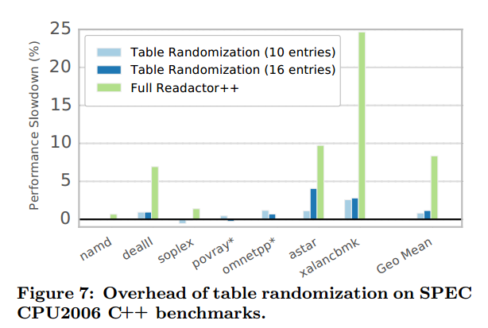

# It's a TRaP: Table Randomization and Protection against Function-Reuse Attacks阅读笔记

**报告目录**

- **要解决什么问题**
- **相关背景知识**
- **该领域研究现状**
- **本论文实现目标**
- **论文核心思想**
- **论文主要贡献**
- **本文具体工作内容分析**
- **工作实现细节**
- **论文中的攻击模型和假设**
- **实验结果评价**
- **结论**

## 要解决什么问题

现有的解决方案关注于返回导向编程技术的攻击，对于像return-into-libc的重用整个函数的攻击很少关注。counterfeit object-oriented programming(COOP) attack表明通过重用动态绑定函数可以绕过现有的防御方案。本文的目的是提高和简化COOP攻击的同时设计防御重用动态绑定函数攻击的方法。

## 相关背景知识

1. **动态绑定函数**

   每一个具有虚函数的类都叫做多态类，这个虚函数或者是从基类继承来的，或者是自己增加的。C++ 编译器必须为每一个多态类至少创建一个虚函数表（vtable），其本质是一个函数指针数组，其中存放着这个类**所有的虚函数的地址**及该类的类型信息，其中也包括那些**继承但未改写（Override）的虚函数**。

   **动态绑定**是指：我们使用基类的引用或指针去调用虚函数，将会发生动态绑定即如果基类指针或引用指向的对象是基类对象，则调用基类的该函数，如果基类的指针或引用指向的是派生类对象则调用的是派生类中的该函数。

2. **动态链接**

   程序运行时，将库文件动态加载到内存中，并将其与可执行文件进行链接。动态库（如 `.dll`、`.so` 文件）独立于程序文件存在，多个程序可以共享相同的动态库。

   **程序加载**
   
   当用户启动一个程序时，操作系统的加载器（Loader）负责将程序的代码段和数据段加载到内存。加载器同时会识别程序依赖的动态库，并将其加载到内存中。
   
   **符号解析**
   
   在动态链接过程中，动态链接器（Dynamic Linker）负责将程序中对外部函数或变量的引用解析到动态库中对应的实际地址。动态链接器通过符号表（Symbol Table）和重定位表（Relocation Table）完成符号绑定和地址重定向。
   
   **延迟绑定（Lazy Binding）**
   
   为了提升程序启动速度，动态链接器可以采用延迟绑定机制，在程序运行到需要使用动态库的函数或变量时，才完成实际的地址解析。延迟绑定减少了启动时的开销，但可能导致首次调用某些函数时有额外的延迟。
   
   **PLT,GOT**

3. **COOP(counterfeit object-oriented programming)**

   

   上图为COOP攻击中的程序流体现。在获取内存布局和控制流劫持方面，与传统的代码重用基本一致，COOP可以通过缓冲区溢出或Use-after-free漏洞，劫持一个虚函数调用，将程序流引导到一个被称为*Main Loop Gadget（ML-G）*的代码片段入口。攻击中所利用到的gadget均为程序中存在的虚函数(*vfgadget*)，为此，攻击者需要将ML-G中的调用对象替换为自己修改后的伪对象（Counterfeit Object），于是便能通过这些伪对象去调用到攻击者想要调用的虚函数。攻击流程可以分为以下三部分：
   （1） 注入伪对象，利用ML-G搭建好虚函数的调用顺序。
   （2） 利用虚函数进行恶意行为的计算以及恶意的写行为。
   （3） 最终调用系统敏感的API，实现恶意行为。

## 该领域研究现状

## 本论文实现目标

填充现存代码随机化方法在防御函数重用攻击的空白

## **论文核心思想**

1. 在保留程序语义的同时排列包含代码指针的表；
2. 在这些表中插入陷阱以减轻探测攻击
3. 转换表，使用`execute-only`页权限来防止内存泄露。

## **论文主要贡献**

1. 防御函数重用攻击

   提出了Readactor++，这是针对函数重用攻击（如counterfeit object-oriented programming(COOP)和return-into-libc (RILC)，现有的代码随机化技术无法减轻这些攻击）的第一个概率性防御方法，同时在设计防御系统时，假设对手可以任意读取和写入内存。

2. 新的技术

   引入编译时间和加载时间转换协同工作，转换和随机化虚拟函数表和动态链接表

3. 真实情况下广泛的评估

   提供了完整的Readactor++模型，展示了详细的评估结果，在现有基准上提高1.1%的开销，还可以扩展到流行的浏览器。

## **本文具体工作内容分析**

1. ### Extending COOP

   - **Recurisive COOP**

     

     使用递归模拟*ML-G*，我们将遵循此模式的虚拟函数称为 ***REC-G***（递归 vfgadget）。REC-G 的工作原理如图 1 中的 C++ 代码：Z::\~Z() 是一个典型的（虚拟）析构函数。它删除对象 objA 并删除对 objB 的引用，在对象 objA 和 objB 上调用虚拟函数。因此，如果在对手控制的伪造对象上调用 Z::\~Z()，对手可以有效控制指针 *objA 和 *objB，并可以使这些指针指向注入的伪造对象。图 1 的右侧描述了基于 REC-G 的 COOP 攻击中攻击者诱导的控制流：实际的 vfgadget 通过 A 调用，而 B 用于递归分支到 REC-G（此处为 Z::\~Z()）。

     任何编译器生成的 Z::\~Z() 的 x86-64 汇编实现都不太可能触及参数寄存器，因此，对于 REC-G Z::\~Z()，攻击者可以自由使用这些寄存器将参数从一个 vfgadget 传递到另一个 vfgadget（均通过调用站点 A 调用）。

     我们强调，不仅是析构函数，任何遵循 Z::\~Z() 模式并在（至少）两个不同且受攻击者控制的对象指针上连续调用虚函数的虚函数都可以用作 REC-G。

   - **Unrolled COOP**

     

     假设一个虚拟函数不仅具有两次连续的虚拟函数调用（如 REC-G），而且具有多次连续的虚拟函数调用，那么也可以发起不依赖于循环或递归的简单展开 COOP 攻击，将启用展开 COOP 的虚拟函数称为 *UNR-G*。

     尽管较长的UNR-G在较大的C++应用程序中并不少见，但更短的UNR-G已经足够破坏系统，经第七节证明执行3个vfgadget足以执行任意代码。

2. ### Readactor++

   目标：证明概率防御可以阻止函数重用攻击。当与内存泄漏弹性代码随机化相结合时，可以防御所有已知的代码重用攻击。

   
   
   (1）分离虚拟表为rvtable（仅读）和xvtable（仅写）两部分。
   
   (2) 插入诱捕器到xvtable和PTL中，可防止对手随机执行 vtable 或 PLT 条目以间接泄露表布局，若调用则通知主机系统。
   
   (3) 收集元数据信息，TRanslation and Protection (TRaP),嵌入到外部二进制文件修复加载时的随机化。
   
   (4) 将运行时随机化引擎RandoLib链接到输出二进制文件中。
   
   #### 1.Vtable randomization
   
   
   
   由于C++对象存储在堆和栈中，必然是可读的，因此防止信息泄露导致的攻击对给定类的对象进行随机化，随机化vtable的布局。
   
   虚拟化表分为rvtable（仅读）和xvtable（仅写）两部分，为了提高内存利用率在rvtable插入xpointer指向对应的xvtable。
   
   #### 2.Procedure Linkage Table Randmization
   
   (1)即使将PLT条目进行随机化，攻击者仍然可通过读取GOT间接获取PLT中条目顺序。通过将延迟绑定改为急切绑定这就允许我们丢弃GOT表
   
   (2)专用编译器会确定哪些调用将通过 PLT 传输，并将每个此类调用点的位置存储在输出 ELF 文件的 TRaP 部分。
   
   (3)RandoLib将可读 GOT 中的所有指针转换为 PLT 中仅可执行的跳板。
   
   (4)打乱PLT中的跳板地址
   
   (5)使用TRaP信息重写所有调用点地址，这些地址指向PLT中已经被随机化的相应地址。
   
   #### 3.Countering Guessing Attacks
   
   我们预计攻击者可能会尝试执行 xvtable 条目和仅执行内存中的其他地址以猜测它们的内容。所以当随机化xvtable和进程连接表时插入陷阱，由于我们不能改变sub-xvtable 的相对排序,确保安全性每个sub-xvtable至少需要16个条目以及最少1/4的陷阱，这样最多添加$([k*n],n_{min}-n)$即可。

## 实现细节

1. **编译器实现**

   (1) 修改LLVM编译器基础工具和目标链接器使代码和数据分离，保证execute-only代码页的权限。

   (2) 修改Clang C++将rvtable分成rvtable和xvtable。

   (3) 修改了 LLVM 的 C++ 前端和代码发射后端，用来添加包含虚拟表中函数位置和数量、类继承层次结构的TRaP信息

   (4) 修改Clang C++前端寻找PLT引用和虚函数调用位置，修改编译器后端在二进制文件中

2. **Runtime Randomization Engine**

   (1)**识别表**

   

   首先，RandoLib从TRaP部分收集PLT和xvtables的位置和大小。在识别了所有xvtable之后，我们必须识别和区分每个类的xvtable的所有副本。Vtables包含与其基类的vtable相对应的子vtable，并且这些对应的子Vtables中的每一个都必须以相同的顺序随机化。

   如图6所示，这些子类中的每一个都有一组vtable条目，对应于类A定义的虚方法；我们称这些集合为子vtable。对于所有通过继承相关的类，子vtable的布局必须相同。对A类型的对象进行操作的虚拟方法调用可以有效地使用A-in-sub-vtable中的任何条目，因为A的子类型之一的任何对象都可以被分配给A类型的指针。这就是为什么我们必须确保每个子-vtable的布局是相互兼容的。

   由于TRaP部分包含整个xvtable的位置和大小，RandoLib必须首先将xvtable拆分为子xvtable，然后按类型将子xvtables分组在一起。由于xvtable的继承关系不能直接在运行时获得，最终采用每个sub-vtable的基类名称信息和RTTI联合推导获得xvtable的继承层次。

   (2) 识别引用

   RandoLib解析所有表引用的目标，这些引用必须更新，以反映置换后的新表布局。

   (3) 随机化

   最后随机所有表序列和更新引用信息

   

   G是一个表示类层次结构的有向图，我们根据RTTI信息计算G。

   G中的每个节点代表一个类，该类有一个子表指针数组（VTables）。

   对于每个sub-xvtable，同时存储其在整表中的前驱表，以及sub-xvtable偏移量。

   XRefsVector是一个（位置、类名称、索引）元组数组，每个元组代表一个xvtable引用。ClassName表示虚拟方法调用的预期对象类型的名称，以及Location从TRaP部分读取。我们通过分解引用来确定索引，这个索引为虚函数调用地址。

   对于每个xvtable引用，我们首先找到调用预期目标类型的主xvtable（第4行）。然后，我们根据子xvtable偏移量解析获得sub-xvttable组（第5-7行）。然后，计算该引用子表中随机化后的索引，并更新引用（第8-10行）。

## **论文中的攻击模型和假设**

### **攻击模型**

- **对手能力**
  - 系统配置：攻击者知道所应用的防御措施，并可以访问目标应用程序的源代码和非随机二进制文件。 
  - 漏洞：目标应用程序存在内存损坏漏洞，攻击者可以利用该漏洞读取和写入任意内存地址。 
  -  脚本环境：攻击者可以利用脚本环境来处理内存泄露，调整攻击负载，然后发起代码重用攻击。
- **防御需求**
  - 可写/可执行内存：目标系统确保内存可以写入或执行，但不能同时为可写或可执行。这可以防止攻击者注入新代码或修改现有的可执行代码。 
  - 只执行内存：我们在以前的强制执行Execute-only Page系统上构建，这些系统强制执行只执行内存页面，即 CPU 可以获取指令，但正常的读取或写入访问会触发访问冲突。
  - JIT 保护：我们假设已采取缓解措施，以防止代码注入 JIT 代码缓存并防止重用 JIT 编译的代码。
  - 暴力破解缓解：要求受保护的软件在遇到终止执行的陷阱后不会自动重启。在浏览器环境中，这可以通过向用户显示警告消息并关闭违规进程来实现。

## **实验结果评价**

Readactor由于trampoline指针通常存储在 vtables 和其他可读数据结构（如 PLT）中的固定偏移量处，因此在很多情况下，对手很容易找到函数的trampoline。有了 Readactor++，尽管对手仍然可以通过存储泄露获得可读结构中的trampoline地址。但是，由于 Readactor++ 会随机化 vtables 和 PLT 的布局，因此识别与函数相匹配的跳板对对手来说是一个挑战。

**安全性评估**

假设对手准确猜到表中具有16个条目（最小值），我们可以用$ P≈ 1 - ( 1/ 16 ) ^n$ 大致估算 Readactor++ 阻止重复使用 n 个函数的攻击的概率。要成功实施 RILC 攻击，攻击者必须正确猜出两个函数指针。第一个函数将所有需要的参数加载到寄存器中，第二个函数是内存保护函数。在 RILC 攻击中，gadgets通过返回指令隐式连锁，而 COOP 攻击则需要一个额外的函数来传递gadgets。第三个函数可以是传统的 ML-G、REC-G 或 UNR-G。因此，攻击者需要至少两个或三个手工挑选的函数（可能来自不同的表），才能分别成功发起 RILC 或 COOP 攻击。所以，阻止这些攻击的概率下限为 $P_{RILC,min} ≈ 1 - ( 1/16 )^ 2 = 0.9960$ 和 $P_{COOP,min} ≈ 1 - ( 1/16 )^3 = 0.9997$。

**性能评估**

使用 SPEC CPU2006 中的 C++ 基准评估了 Readactor++，Readactor++ 带来了 1.1% 的微小开销，加上使用Readactor系统运行只执行内存和隐藏代码指针的策略下Readactor++ 在 SPEC 上平均开销为 8.4% 。

## **结论**
