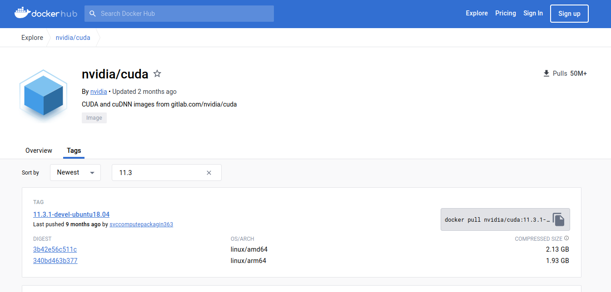
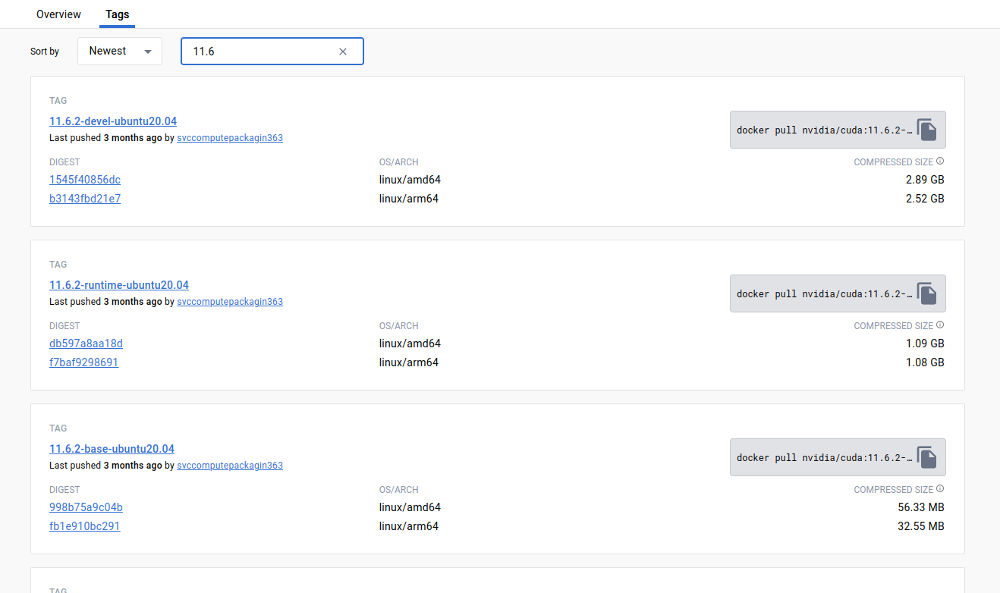

# 基础命令

## 1. 查看容器

列出已经创建的所有容器

```bash
docker ps -a    
```

列出正在运行的容器

```bash
docker ps -s 
```

## 2. 启动容器

```bash
docker start [container ID]
```

## 3. 进入已经运行的容器

方法一（推荐）

```bash
docker attach [container ID]
```

方法二（未使用）

```bash
docker exec -it [container ID] /bin/bash
```

## 4. 退出容器

```bash
exit
```

## 5. 停用容器

```bash
docker stop [container ID]
```

# docker 获取Nvidia 镜像

## **1、查看有那些Nvidia 镜像**

来到docker hub官网，查看有那些Nvidia 镜像

https://hub.docker.com/r/nvidia/cuda/tags?page=2&name=11.3



这里可以输入cuda的版本比如11.6，或筛选出相关的镜像：

https://hub.docker.com/r/nvidia/cuda/tags?page=1&name=11.6



## 2、拉取镜像到本地

```python
docker pull nvidia/cuda:11.1.1-devel-ubuntu20.04
```

## 3、查看镜像，打开镜像

拉取镜像完成后，用docker images命令查看镜像的情况：

```python
docker images
```

**打开镜像（常规模式--支持使用GPU）**

```python
docker run -i -t --gpus all nvidia/cuda:11.1.1-devel-ubuntu20.04  /bin/bash
```

**打开镜像（增强模式--支持使用GPU、映射目录、设置内存）**

```python
docker run -i -t -v /home/liguopu/:/guopu:rw --gpus all --shm-size 16G nvidia/cuda:11.1.1-devel-ubuntu20.04  /bin/bash
```

平常进入了docker环境，然后创建或产生的文件，在退出docker环境后会“自动销毁”；或者想运行本地主机的某个程序，发现在docker环境中找不到。

我们可以通过映射目录的方式，把本地主机的某个目录，映射到docker环境中，这样产生的文件会保留在本地主机中。

通过-v 把本地主机目录 /home/liguopu/ 映射到docker环境中的/guopu 目录；其权限是rw，即能读能写。

默认分配很小的内参，在训练模型时不够用，可以通过参数设置：比如，我电脑有12G内参，想放12G到docker中使用，设置为 --shm-size 12G。

## 4、测试镜像cuda和cudnn

用`nvidia-smi`看看显卡信息

用`nvcc -V `命令查看实际的cuda版本

用`ls /usr/local/`命令看看cuda安装路径

## 5、安装conda环境

默认的系统镜像可能没有conda也没有python，我们可以安装Anaconda，来搭建深度学习环境

官方下载地址：[Free Download | Anaconda](https://www.anaconda.com/download/)

**安装Anaconda3**

进入下载文件的位置，打开终端terminal在文件目录下，使用bash 执行安装就可以啦：

```python
bash Anaconda3-2023.07-2-Linux-x86_64.sh
```

安装过程：

1）输入回车键确认安装；

2）阅读Anaconda最终用户许可协议，按下回车浏览完信息；

3）问我们是否接受该协议，只能接受了，输入yes；（Do you accept the license terms? [yes|no]）

4）提示安装到以下位置，回车确认即可；（Anaconda3 will now be installed into this location:）

5）是否加入环境变量，通常是选择yes的；这个根据自己情况选择，如果经常用conda环境开发，建议选择yes（Do you wish the installer to initialize Anaconda3 in your /home/linuxidc/.bashrc ? [yes|no]）

# docker容器和镜像的停止和删除

## 1、停止所有容器

```python
docker stop $(docker ps -aq)
```

docker stop操作的对象是 container id 而不是 image name

## 2、删除所有容器

```python
docker rm $(docker ps -aq)
```

## 3、删除镜像

```python
# 通过 image name 删除单个镜像
docker image rm $image_name

# 通过 image id 删除单个镜像
docker rmi $image_id

# 删除所有镜像
docker rmi $(docker images -q)

# 删除所有停止的容器
docker container prune -f

# 删除所有不使用的镜像
docker image prune --force --all 
# 或者 
docker image prune -f -a
```

## Docker复制

如何将本地文件复制到docker容器内
我们通过docker cp指令来将容器外文件传递到docker容器内

**1、查看容器ID**

```python
docker ps -a
```

**2、将本地文件复制到docker容器中**

**docker cp 本地文件路径 容器ID/容器NAME:容器内路径**
举例：

```python
docker cp /Users/wuhanxue/Downloads/rabbitmq_delayed_message_exchange-3.9.0.ez 1faca6a70742:/opt/rabbitmq/plugins或者通过容器名
```

```python
docker cp /Users/wuhanxue/Downloads/rabbitmq_delayed_message_exchange-3.9.0.ez rabbit:/opt/rabbitmq/plugins
```

**3、从docker容器复制文件到本地**
也是同样通过docker cp指令

**docker 容器名或容器id:容器内路径 本地路径**
如将容器中的/application/dump.hprof文件复制到本机的/data/dump.hprof

```python
docker cp b21161f6815c:/application/dump.hprof /data/dump.hprof
```


------


参考:

1. [Docker简单容器命令](https://blog.csdn.net/jghiof/article/details/117687974?spm=1001.2101.3001.6661.1&utm_medium=distribute.pc_relevant_t0.none-task-blog-2%7Edefault%7ECTRLIST%7ERate-1-117687974-blog-124920551.pc_relevant_multi_platform_whitelistv3&depth_1-utm_source=distribute.pc_relevant_t0.none-task-blog-2%7Edefault%7ECTRLIST%7ERate-1-117687974-blog-124920551.pc_relevant_multi_platform_whitelistv3&utm_relevant_index=1)

2. [docker 获取Nvidia 镜像 | cuda |cudnn_nvidia docker镜像-CSDN博客](https://blog.csdn.net/qq_41204464/article/details/132891018)
3. [docker容器和镜像的停止和删除_docker 停止镜像-CSDN博客](https://blog.csdn.net/Trembler/article/details/118525175)
4. [docker：如何将本地文件复制到docker容器内 | 从docker复制文件到本地_docker拷贝文件到容器-CSDN博客](https://blog.csdn.net/qq_24950043/article/details/124182829)
