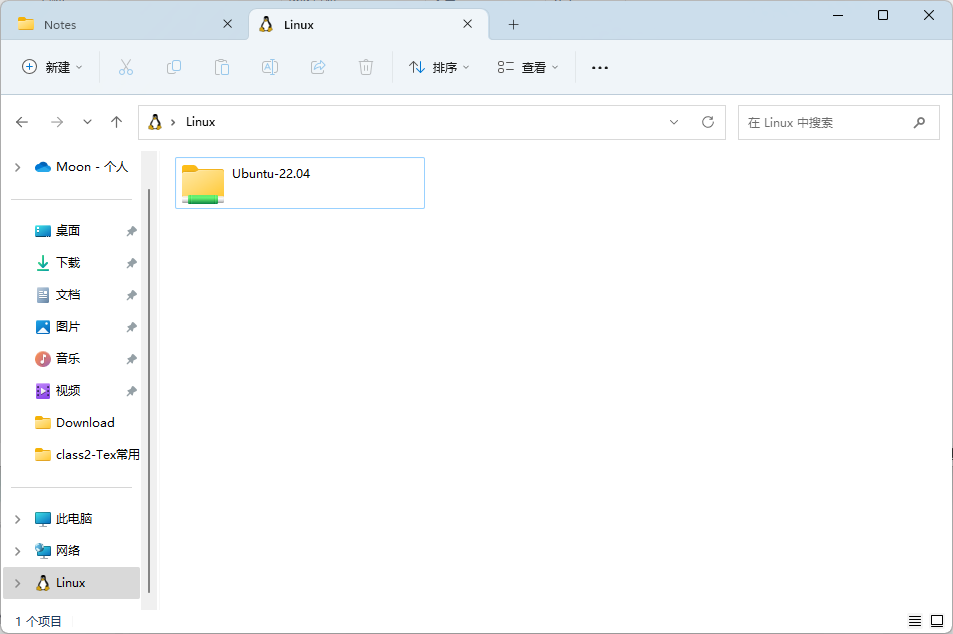

# WSL安装步骤

## 开启Windows功能

启用“适用于 Linux 的 Windows 子系统”可选功能

```
dism.exe /online /enable-feature /featurename:Microsoft-Windows-Subsystem-Linux /all /norestart

BASH
```

启用虚拟机功能

```
dism.exe /online /enable-feature /featurename:VirtualMachinePlatform /all /norestart

BASH
```

## 下载linux内核更新包

[旧版 WSL 的手动安装步骤 | Microsoft Learn](https://learn.microsoft.com/zh-cn/windows/wsl/install-manual#step-4---download-the-linux-kernel-update-package)

## 将 WSL 2 设置为默认版本

```
wsl --set-default-version 2

ACTIONSCRIPT
```

## 安装所选的 Linux 分发

打开Microsoft Store，选择Linux分发版下载获取即可。

# Linux子系统(WSL)文件目录

## windows访问Linux目录

ubuntu Linux子系统的目录是在这个目录下

```
C:\Users\用户名\AppData\Local\Packages\CanonicalGroupLimited.UbuntuonWindows_79rhkp1fndgsc\LocalState\rootfs

MOONSCRIPT
```

wsl2保持原有路径情况下，linux的文件系统整个是个镜像文件，启动系统后，这个文件系统映射到了 `\\wsl$\系统名` 下面



## Linux访问windows文件

windows的磁盘被挂载到了/mnt下，可以直接访问

# 比较 WSL 2 和 WSL 1

## 比较功能

| 功能                                            | WSL 1 | WSL 2 |
| ----------------------------------------------- | :---: | :---: |
| Windows 和 Linux 之间的集成                     |   ✅   |   ✅   |
| 启动时间短                                      |   ✅   |   ✅   |
| 占用的资源量少                                  |   ✅   |   ✅   |
| 托管 VM                                         |   ❌   |   ✅   |
| 完整的 Linux 内核                               |   ❌   |   ✅   |
| 完全的系统调用兼容性                            |   ❌   |   ✅   |
| 可以与当前版本的 VM Ware 和 VirtualBox 一起运行 |   ✅   |   ❌   |
| 跨 OS 文件系统的性能                            |   ✅   |   ❌   |

## 例外情况（使用 WSL 1 而不是 WSL 2）

我们建议使用 WSL 2，因为它提供更快的性能和100% 的系统调用兼容性。 但是，在某些特定情况下，你可能会更倾向于使用 WSL 1。 在以下情况下，请考虑使用 WSL 1：

你的项目文件必须存储在 Windows 文件系统中。
如果你将使用 WSL Linux 分发版来访问 Windows 文件系统上的项目文件，并且这些文件无法存储在 Linux 文件系统上，那么，通过使用 WSL 1，你将跨 OS 文件系统实现更快的性能。
一个项目要求对相同的文件使用 Windows 和 Linux 工具进行交叉编译。
在 WSL 1 中，跨 Windows 和 Linux 操作系统的文件性能比 WSL 2 中更快，因此如果要使用 Windows 应用程序来访问 Linux 文件，则目前通过 WSL 1 可实现更快的性能。
